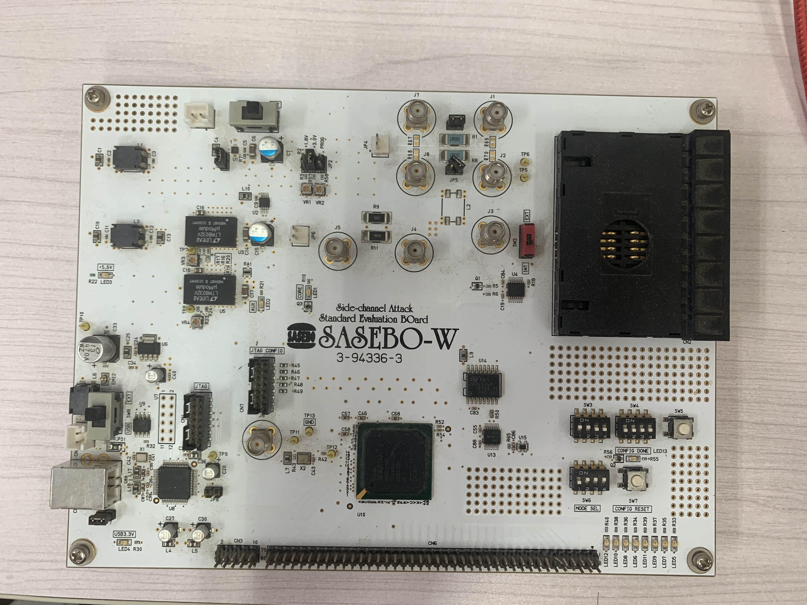
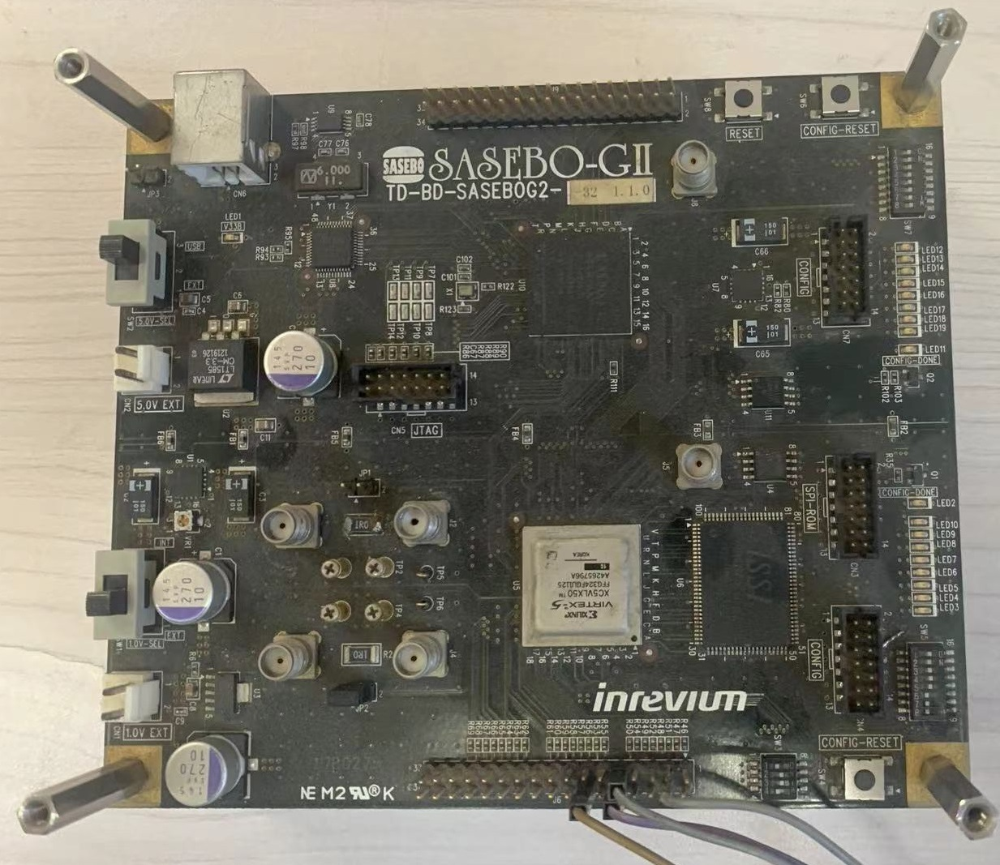
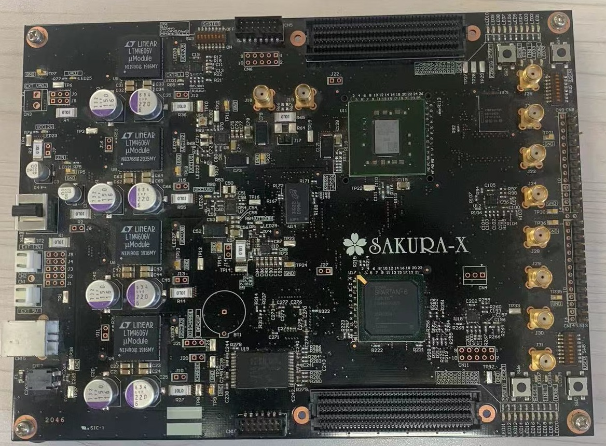
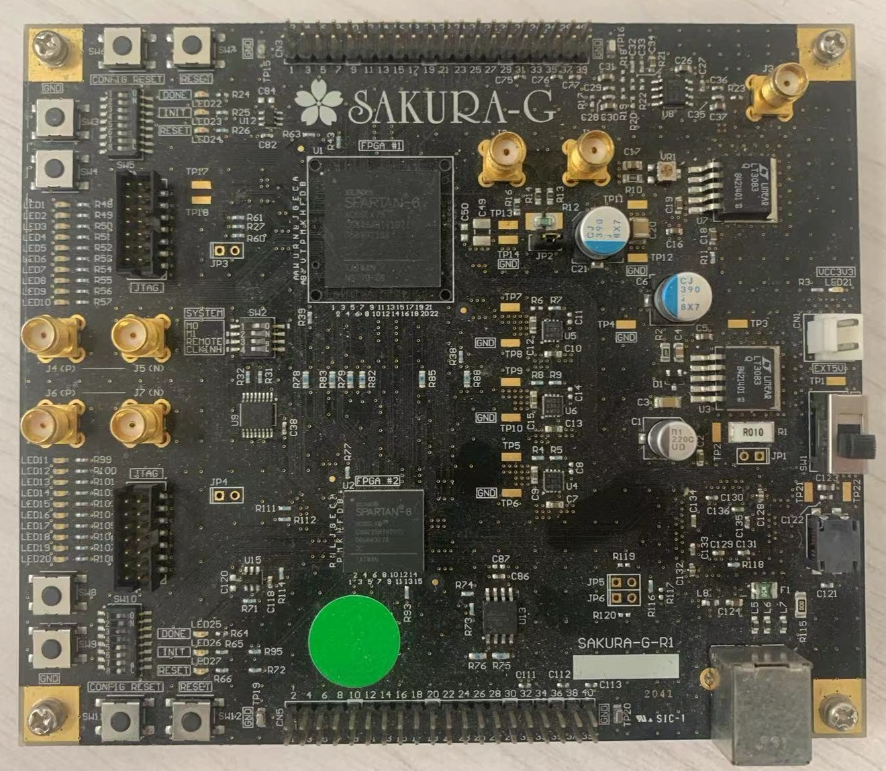

# 开发板教程
侧信道评估板有
sasebo <a href=#ref1>[1]</a>,<a href=#ref2>[2]</a> 和 sakura项目<a href=#ref3>[3]</a>两个项目。

## SASEBO项目和SAKURA项目
正解：

  - SASEBO的全称是Side-channel Attack Standard Evaluation BOard。
  - SAKURA的全称是[Side-channel AttacK User Reference Architecture](http://www.troche.com/sakura/sakura.html)。

另解：

  - sasebo是日本的一个地名，佐世保。
  - sakura是樱花🌸的意思。

sakura项目是sasebo项目的后继。

若要下载开发板的资料，建议前往SASEBO项目的主页[SASEBO project](https://satoh.cs.uec.ac.jp/SASEBO/en/index.html)和SAKURA项目的主页[SAKURA project](https://satoh.cs.uec.ac.jp/SAKURA/index.html)。在本教程的`Materials`文件夹中也有课题组拥有的四款开发板的资料。

## 现有开发板
课题组拥有四种板子，分别是sasebo-w，sasebo-gii，sakura-x, sakura-g。

<!-- 其中焦志鹏师兄对SM4的综合防护代码是基于sasebo-giii中的代码写的。 -->

开发板之间的关系：

  - sasebo-giii和sakura-x之间的关系是：sakura-x是sasebo-giii的商业版本。
  - sakura-g高度兼容sasebo-gii

<!-- 那么这个代码可以用于sakura-g吗？ -->

不同开发板之间的代码不能共用。

  - 在github上有人改变了`sakura-g`的代码用于`sasebo-giii`<a href=#ref4>[4]</a>。

**开发板资料下载地址**

| 开发板        | 资料下载地址                                                    |
|------------|-----------------------------------------------------------|
| SASEBO-W   | https://satoh.cs.uec.ac.jp/SASEBO/en/board/sasebo-w.html  |
| SASEBO-GII | https://satoh.cs.uec.ac.jp/SASEBO/en/board/sasebo-g2.html |
| SAKURA-G   | https://satoh.cs.uec.ac.jp/SAKURA/hardware/SAKURA-G.html  |
| SAKURA-X   | https://satoh.cs.uec.ac.jp/SAKURA/hardware/SAKURA-X.html  |

**使用iMPACT下载代码到开发板时所需的信息**

| 开发板        | 控制芯片型号           | flash ROM型号                            | 接口   | 加密芯片型号            | flash ROM型号                                  | 接口  | 备注                  |
|------------|------------------|----------------------------------------|------|-------------------|----------------------------------------------|-----|---------------------|
| SASEBO-W   | XC6SLX150 -FGG484 | M25P64                                 | CN7  |                   |                                              |     | 仅有一块FPGA            |
| SASEBO-GII | XC3S400A         | ST45DB16D                              | CN7  | XC5VLX30 -1FFG324  | ST45DB16D                                    | CN4 |                     |
| SAKURA-G   | XC6SLX9     | SPI PROM AT45DB321D                  | CN4  | XC6SLX75- 2CSG484C | SPI PROM  AT45DB321D                       | CN2 |                     |
| SAKURA-X   | XC6LX45- 2FGG484C | BPI Flash Memory **XCF32P** VOG48C | CN10 | XC7K160T -1FBGC    | BPI Flash Memory PC*28F640P30*TF65 **28F128P30B** | CN5 | spec和qsg中rom 型号描述不一致 |

**课题组拥有的几款板子**

图1

图2

图3

图4

## 参考
1. 
Side-channel Attack Standard Evaluation BOard (SASEBO).https://satoh.cs.uec.ac.jp/SASEBO/en/index.html

2. 
Evaluation Environment for Side-channel Attacks - Side-channel Attack Standard Evaluation BOard file download site.https://www.risec.aist.go.jp/project/sasebo/

3. 
SAKURA project.https://satoh.cs.uec.ac.jp/SAKURA/index.html

4. 
SASEBOGIII-with-SASEBOG-AES.https://github.com/dnjayasinghe/SASEBOGIII-with-SASEBOG-AES

